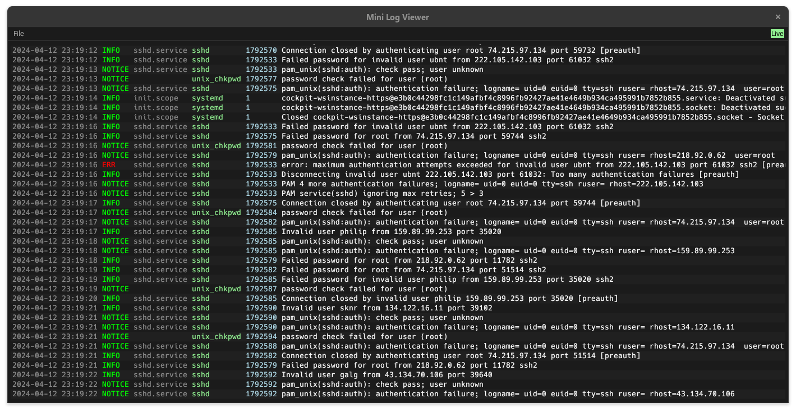

# Mini Log Viewer
[](https://crates.io/crates/mini-log-viewer)
[](https://github.com/Ewpratten/mlv/actions/workflows/build.yml)
[](https://github.com/Ewpratten/mlv/actions/workflows/clippy.yml)

`mlv` is a small log viewer application that works with files and streams.



```sh
# Reading a file
mlv /path/to/file.log

# Reading Journalctl output
mlv -p journal-json <(journalctl -o json -f)

# Reading from a remote machine
mlv <(ssh user@host "cat /path/to/remote.log")
```

## Installation

This crate can be installed via `cargo` with:

```sh
cargo install mini-log-viewer
```

Don't forget, the installed binary is called `mlv`.